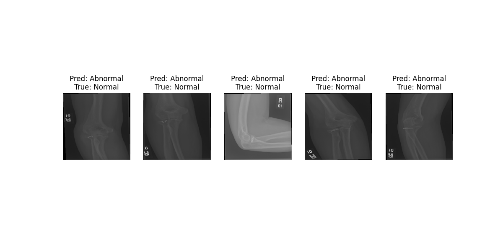

# Object Detection & Classification Model - MURA Dataset



## 📌 Overview
This repository implements a deep learning solution for detecting abnormalities in musculoskeletal radiographs using the **MURA (MUsculoskeletal RAdiographs)** dataset. 

Beyond standard binary classification (Normal vs. Abnormal), this project focuses on **Explainable AI (XAI)**. It includes an `explainer` module that generates heatmaps to visualize the specific regions of the X-ray that led to the model's decision, effectively providing weakly-supervised object detection and localization of fractures or anomalies.

## 📂 Dataset
The project utilizes the **MURA Dataset**, one of the largest public radiographic image datasets, released by the Stanford ML Group.

* **Task**: Binary Classification (Normal vs. Abnormal)
* **Body Parts Covered**: Elbow, Finger, Forearm, Hand, Humerus, Shoulder, Wrist.
* **Dataset Link**: [link]([https://www.kaggle.com/datasets/cjinny/mura-v11])

## 🚀 Key Features
* **Robust Classification**: A CNN-based architecture designed to handle the variability in X-ray imaging.
* **Model Explainability**: Uses techniques (likely Grad-CAM or Saliency Maps) to generate heatmaps, highlighting the "area of interest" where the abnormality is detected.
* **Performance Tracking**: Visualizes training progress including accuracy and loss curves.

## 📁 Repository Structure

| File / Folder | Description |
| :--- | :--- |
| `XRayClassification.py` | Main script containing the model architecture, training loop, and evaluation logic. |
| `explainer.py` | Script responsible for generating visual explanations (heatmaps) to interpret model predictions. |
| `heatmaps/` | Directory where generated heatmap images are saved. |
| `training_history.png` | Plot showing the training and validation loss/accuracy over epochs. |
| `sample_predictions.png` | Example output image showing input X-rays and model predictions. |

## 🛠️ Installation & Requirements

1.  **Clone the repository:**
    ```bash
    git clone [https://github.com/Wolfram-St/Object-Detection-Classification-Model-MURA-Dataset-.git](https://github.com/Wolfram-St/Object-Detection-Classification-Model-MURA-Dataset-.git)
    cd Object-Detection-Classification-Model-MURA-Dataset-
    ```

2.  **Install dependencies:**
    *(Note: Ensure you have Python installed. The specific requirements depend on the libraries used in the scripts, but generally include the following)*
    ```bash
    pip install numpy pandas matplotlib opencv-python scikit-learn
    # specific deep learning framework (install the one used in XRayClassification.py)
    # pip install torch torchvision  # If using PyTorch
    # pip install tensorflow keras   # If using TensorFlow/Keras
    ```

## 💻 Usage

### 1. Train the Model
To start training the classification model on the MURA dataset:
```bash
python XRayClassification.py
